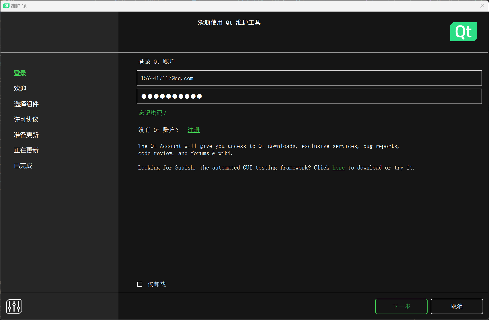
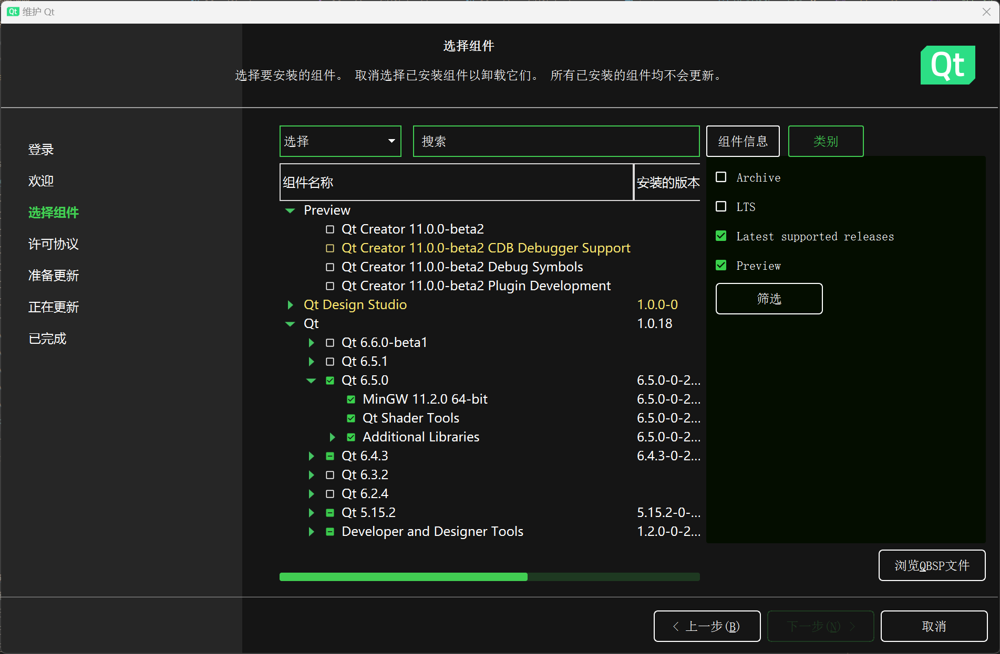
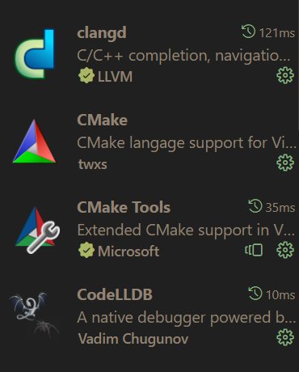
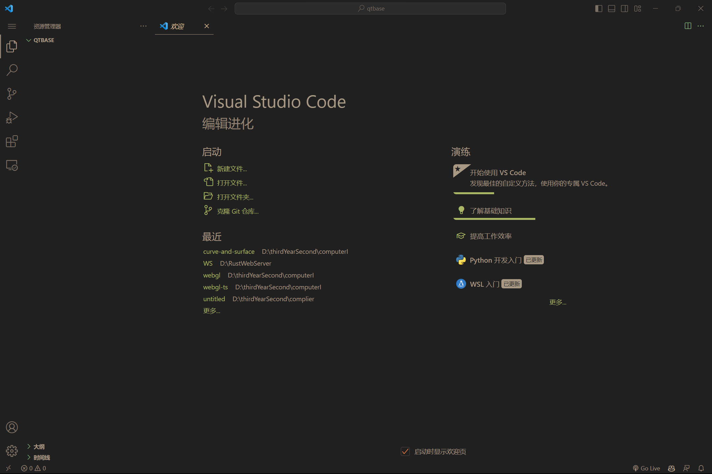
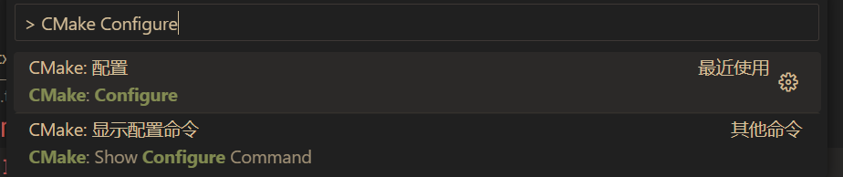
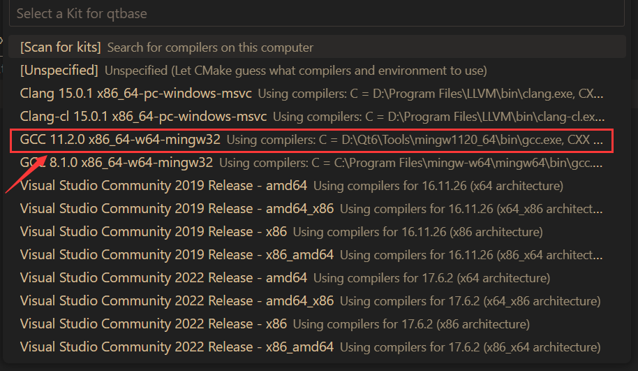

# curve and surface

## 简介

使用Qt6.5.0开发

实现了简单的通过鼠标的曲线曲面绘制。算法全部手写。

使用CMake管理项目，在运行时注意设置环境变量``Qt6_DIR`` ，同时保证Qt的依赖包在环境变量或者在运行目录下。

## 完成情况

- [x] bezier曲线和曲面的绘制。
- [x] bspline曲线和曲面的绘制，支持设置阶数。
- [x] 鼠标键盘操作（鼠标拖动（左键），放缩（滑轮），旋转（右键），WASD（前后左右），Space（向上），Shift（向下））
- [x] 曲线曲面的导出和导入。
- [x] 添加点和删除点。
- [ ] 动画效果
- [ ] 鼠标拖动点移动
- [ ] NURBS曲线曲面

## 项目配置

### 下载Qt
前往[Qt下载网站](https://download.qt.io/official_releases/online_installers/)下载


选择对应的平台


下载完成后打开会看见以下界面。



如果没有账号先注册，注册完成后登录。


第一次登录应该会选择安装目录，选择一个能记住地方的地址即可。
然后选择Custom Installation


按照以下选择勾选6.5版本的mingw编译器（剩下两个不用选也行）



之后继续往后点击完成安装


接下来将Qt加入环境变量。


不同平台有不同加入环境变量的方式，设置``Qt6_DIR``环境变量为安装Qt的mingw地址，将``{Qt6_DIR}/bin``加入环境变量即可


例如我的``Qt6_DIR``为``D:/Qt6/6.5.0/mingw_64/``


还需要将``D:/Qt6/Tools/mingw1120_64``加入环境变量，用于后面的CMake配置
### 开发工具下载
这里我选择VSCode作为开发工具。


下载vscode可以前往[官网](https://code.visualstudio.com/Download)选择对应的版本下载。


安装完成后，前往扩展页，下载以下几个扩展，如果英文不好可以下载Chinese简体中文包，汉化vscode


CMake用于配置项目，clangd用于代码提示，CodeLLDB用于调试代码

**注意：下载clangd和CodeLLDB可能需要科学上网**





输入``Ctrl+Shift+p``在出现的窗口中输入``Open Workspace Settings``进入设置，


在上方搜索栏输入``cmake path``配置CMake路径，例如我的路径为``D:/Qt6/Tools/CMake_64/bin/cmake.exe``对应更改即可。


创建一个新的文件夹选择打开。



新建一个文件命名为``CMakeLists.txt``


输入``Ctrl+Shift+p``在出现的窗口中输入``CMake Configure``


选择之前加入环境变量的编译器



创建``main.cpp``

创建``res.qrc``文件，创建``shader``文件夹，在``shader``文件夹中加入文件``fragment.frag`` ，``vertex.vert`` （非必做）


之后在``CMakeLists.txt``中加入以下内容

```CMake
cmake_minimum_required(VERSION 3.20)
project(curve-and-surface)
# 设置C++标准，至少为17
set(CMAKE_CXX_STANDARD 17)
set(CMAKE_AUTOMOC ON)
set(CMAKE_AUTORCC ON)
set(CMAKE_AUTOUIC ON)


set(CMAKE_PREFIX_PATH $ENV{QT6_DIR})
# 生成compile_commands交给clangd使用
set(CMAKE_EXPORT_COMPILE_COMMANDS true)

# 加入需要的包
find_package(Qt6 COMPONENTS
        Core
        Gui
        Widgets
        OpenGL
        OpenGLWidgets
        REQUIRED)

qt_add_resources(qrc_FILES res.qrc)

add_executable(curve-and-surface
        main.cpp
        ${qrc_FILES}
        )

# 连接库，注意要加入glu32和opengl32
target_link_libraries(curve-and-surface
        Qt::Core
        Qt::Gui
        Qt::Widgets
        Qt::OpenGL
        Qt::OpenGLWidgets
        glu32
        opengl32
        )
```


在``res.qrc``中加入以下内容（非必做）

```xml
<RCC>
    <qresource prefix="/">
        <file>shader/fragment.frag</file>
        <file>shader/vertex.vert</file>
    </qresource>
</RCC>
```


在``main.cpp``中加入以下代码
```cpp
#include <QApplication>
#include <QOpenGLWidget>


int main(int argc, char* argv[]) {
    QApplication app(argc, argv);
    QOpenGLWidget *openglWidget = new QOpenGLWidget();
    openglWidget->show();
    return app.exec();
}
```

输入``Ctrl+Shift+p``在出现的窗口中输入``CMake Build``选择正确的选项。


build成功后按下F5会提示生成``launch.json``文件，接下来会自动生成``launch``文件，在``launch.json``文件中输入以下内容
```json
{
    "version": "0.2.0",
    "configurations": [
        {
            "type": "lldb",
            "request": "launch",
            "name": "Debug",
            "program": "${workspaceFolder}/build/curve-and-surface.exe",
            "args": [],
            "cwd": "${workspaceFolder}"
        }
    ]
}
```

之后按下``F5``会出现一个漆黑的窗口，代表成功运行。


如果未能成功运行，检查以下配置
- 是否正确设置``Qt6_DIR``环境变量
- 环境变量中是否存在``opengl32.dll``和``glu32.dll``（Windows系统一般位于``C:/Windows/System32``）
- 是否正确配置CMake且build成功（CMake需要使用Qt附带的）。


如果依然未能运行成功可以通过邮件<neige7QAQ7@outlook.com>联系我。